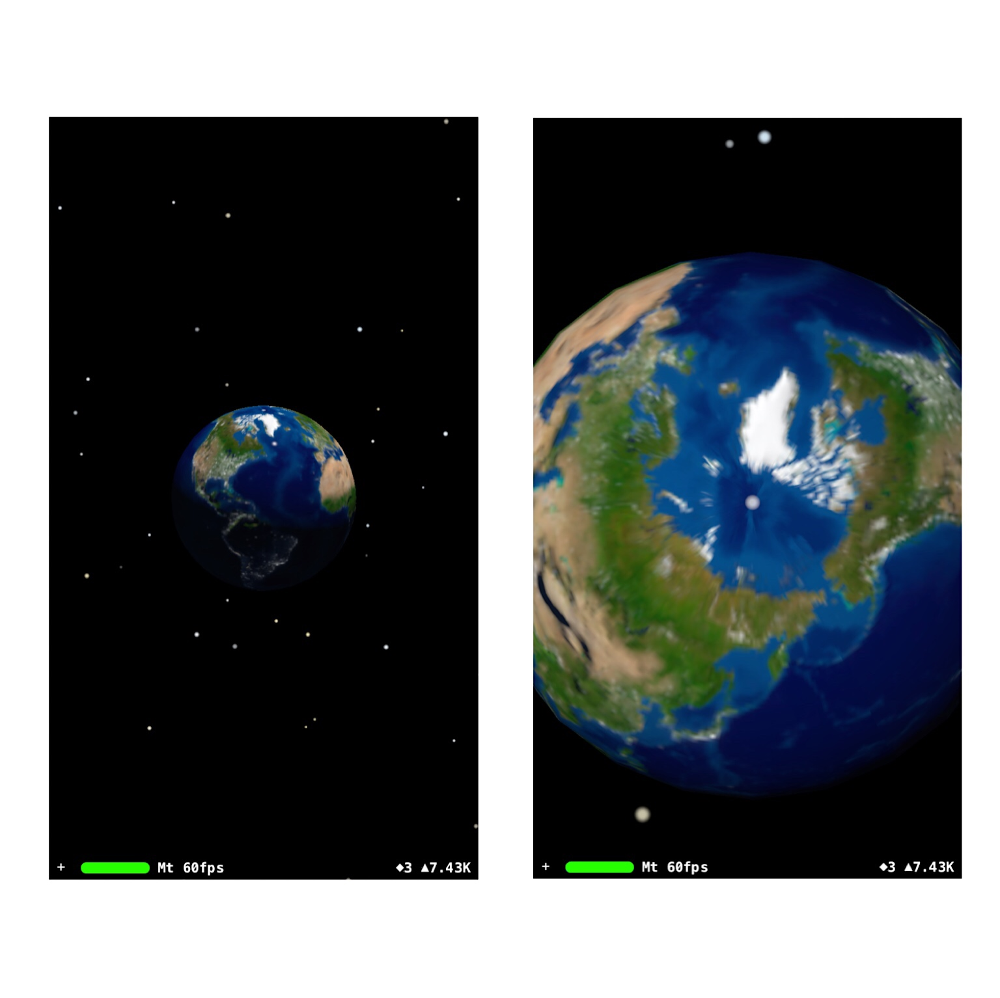
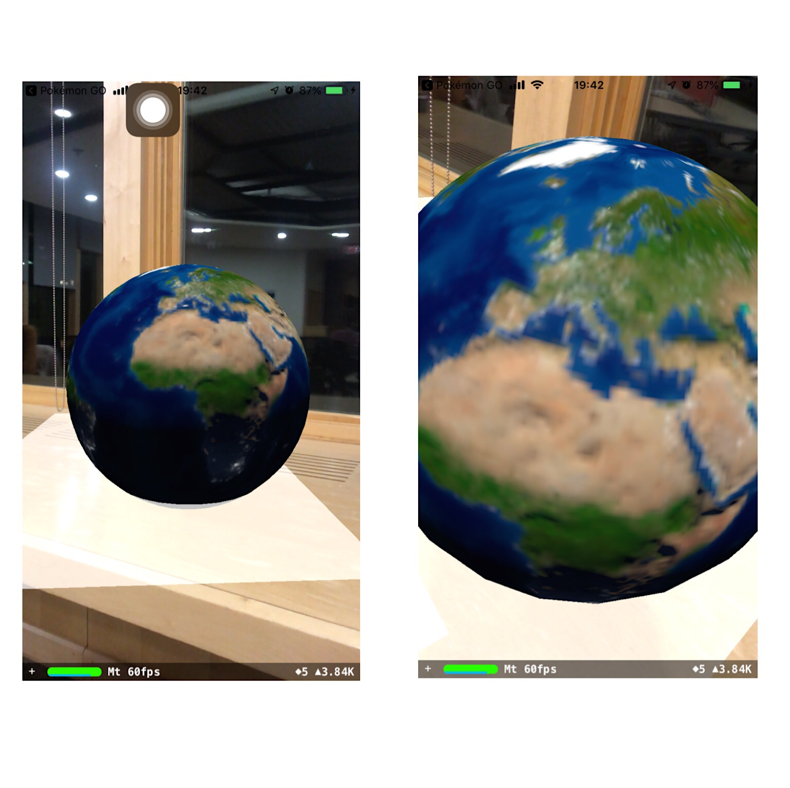

# hack-a-thing-2

Hack-a-thing 2 for CS98

Qirong Li and Xinchen (Olivia) Zhao

### Our Project

Our goal is to make an iOS app that applies augmented reality to observe different angles of the Earth.

The first part is to use set up the UI and the Earth using a scene kit. We followed [this tutorial](https://www.youtube.com/watch?v=3rpNDENQgPM) to set up the scene, a camera, the Earth, the particle system in the background, and the lighting. We added axis and location so that the Earth renders differently when the user is at different distance and angles. To change the distance and angles, pinch the screen to zoom in and out, and swipe to rotate view.

The second part is to use ARKit to implement placing the Earth in the augmented reality world on your phone. We also implement plane detection and light estimation which allow us to place the earth above the plane detected and adjust the lighting of the Earth based on the light of surroundings. For this part we followed [this tutorial](https://www.youtube.com/watch?v=4aIVHV5Q7a0) for AR setup and [this tutorial](https://www.youtube.com/watch?v=mkD5Jw-bLLs) for plane detceetion and light estimation.

### How It Works

For the star background version of the app, open the app and it will demonstrate an Earth from a distance. The user can pinch the screen to zoom in and out, and swipe to rotate their point of view.

For the AR version of the app, open the app and it will automatically detect the plane your camera is capturing. Touch the plane to place an Earth above it. Change the lighting of the surroudings and observe how the 3D earth changes with the lighting.

### Distribution of Work

Qirong Li:
- Set up scene, camera, and Earth
- Build the particle system and lighting for the Earth
- Add axis and location

Olivia Zhao: 
- Add AR feature to the app using ARKit
- Implement plane detection
- Implement light estimation

### What We Learned

We learned how to use SceneKit to put 3D objects into a 2D environment and further to add ARKit to put 3D objects into the real world. It was fun to implement physics laws like distance and lighting into code. We also learned how to use ARKit to detect plane surfaces and how 3D objects can be affected by its environment using light estimation.

### What Didn't Work

1. The Earth in the scene kit doesn't have the best precision and we didn't have time to find our own  world map and render it in a sphere. 

2. When the user is too close to the Earth, or "inside" the Earth, they can still see the display of the Earth, but of the opposite side. Only when they go as far as completely outside of the Earth will the Earth disappear. It would be cool if we could show the inside of the Earth instead of the blue and green scene which is not what one would see when they are inside the mantle/core :)
